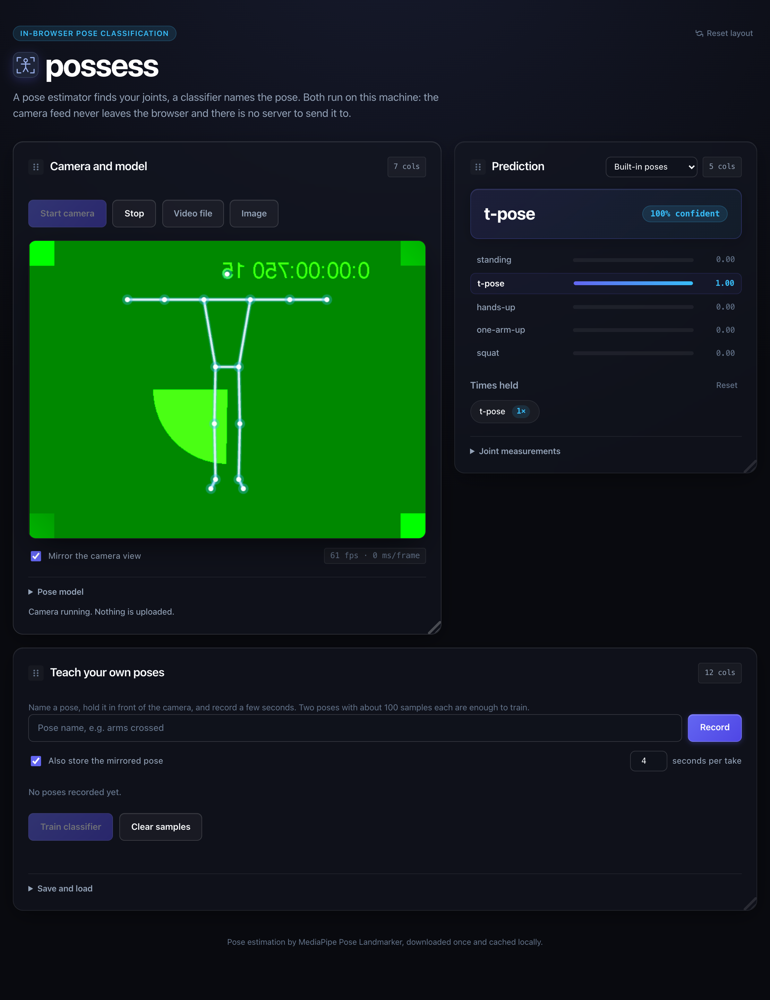

# poser

Teach a browser to recognize poses. A pose estimator finds your joints, a
classifier names the pose, and both run on your own machine: the camera feed
never leaves the page, and there is no server for it to leave to.

Two classifiers ship with it. The **built-in** one knows five everyday poses
from joint angles alone and works the moment the camera starts. The **trained**
one is yours: record a few seconds of each pose you care about, press train, and
a small neural network learns them in the page, in under a second.

## Demo

**Live Demo**: [https://shubin123.github.io/poser/](https://shubin123.github.io/poser/)



*The page running against the test harness, which replays synthetic skeletons
instead of a camera — hence the bare stick figure. Everything else is the real
thing: the same rules, the same trained classifier, the same overlay.*

## How it works

```
camera frame ─► Pose Landmarker ─► 33 landmarks ─► feature vector ─► classifier ─► smoothing ─► label
                (MediaPipe, WASM/GPU)              (60 numbers)       (rules | k-NN | MLP)
```

### 1. Pose estimation

[MediaPipe Pose Landmarker][mp] (BlazePose GHUM, the successor to the
PoseNet/MoveNet line) returns 33 landmarks per frame. The task bundle comes from
jsDelivr and the weights from Google's model bucket; both are fetched once and
then served from IndexedDB, so later visits start offline-fast.

| Variant | Download | Notes |
| --- | --- | --- |
| Lite | 5.5 MB | Default. Real time on a laptop webcam. |
| Full | 9.0 MB | Steadier landmarks, still real time on most machines. |
| Heavy | 29.2 MB | Most accurate, noticeably slower without a GPU. |

[mp]: https://ai.google.dev/edge/mediapipe/solutions/vision/pose_landmarker

### 2. Features (`features.js`)

Raw landmarks make a poor classifier input: they move when you walk across the
frame, grow when you step towards the camera, and stretch with the aspect ratio
of the video. The feature builder removes all three, then adds the quantities
that describe posture directly:

1. `x` is multiplied by the frame's aspect ratio, so geometry is isotropic.
2. The hip midpoint becomes the origin.
3. Everything is divided by a torso-derived scale — `max(torso × 2.5, distance
   to the furthest point)`, the normalization from Google's MoveNet pose
   classification recipe.
4. Appended: eight joint angles (elbows, shoulders, hips, knees), five limb
   directions measured against vertical, and four body ratios (stance width,
   shoulder-to-ankle extension, wrist span, knee drop). Angles are encoded as
   `cos`/`sin` so the classifier never meets the ±π discontinuity.

That is **60 numbers**, of which 30 are normalized coordinates and 30 are
derived geometry. The dense face and hand landmarks are dropped: they add noise
and say nothing about the pose.

### 3. Classification

- **Built-in rules** (`rules.js`) — each pose is a fuzzy AND of soft constraints
  on angles and ratios, so scores fade at the edges of a pose instead of
  snapping. Knows `standing`, `t-pose`, `hands-up`, `one-arm-up` and `squat`,
  and says `unknown` rather than guessing. Costs nothing and needs no data.
- **k-nearest neighbours** (`classifier.js`) — distance-weighted vote over the
  samples you recorded, on standardized features. Answers the moment a second
  pose has been recorded, before any training.
- **Neural network** (`classifier.js`) — 60 → 32 ReLU → softmax, trained with
  Adam, L2 and a stratified 20% holdout, in plain JavaScript. A few hundred
  samples train in well under a second, and the result serializes to a few
  kilobytes of JSON.

Written without a tensor library on purpose: the input is 60 numbers wide, so
the page needs no ML runtime for the classifier at all, and the same code runs
under `node --test`.

### 4. Smoothing

Live predictions flicker. An exponential moving average over the probability
vector, plus a hold-and-threshold rule before the reported label changes, gives
a steady readout — and each commit to a new label is one repetition, which is
where the "times held" counter comes from.

## Privacy

Frames are read from `getUserMedia` into a canvas, turned into 60 numbers and
discarded. Recorded samples are those numbers, kept in `localStorage`; the
trained model is kept there too. Nothing is uploaded — the only network requests
the page ever makes are for the pose model itself, and the end-to-end test
asserts exactly that.

## Run it

Serve the repository over HTTP (a camera needs a secure context, which
`localhost` counts as) and open the address:

```bash
npm run serve   # python3 -m http.server 8000
```

No build step. The page is plain HTML, CSS and JavaScript.

## Test

```bash
npm run test:unit   # features, classifier, rules, dataset - no dependencies
npm ci && npm test  # adds the Puppeteer end-to-end run
```

The unit tests run on synthetic skeletons built from anthropometric
proportions (`tests/fixtures.js`), which lets them vary pose, position, apparent
size and aspect ratio — exactly what the normalization is supposed to absorb.

The end-to-end test swaps in a fake MediaPipe module that replays those
skeletons, then drives the whole page: load, classify with the rules, record two
poses, train, classify with the trained model, reload, and confirm the samples,
the weights and the cached model all came back. It also asserts that the page
contacted nothing but the two model CDNs.

### Calibration against real photographs

The built-in thresholds were fitted to measurements from real photographs, not
guessed. Perspective matters more than it looks: standing people measured
between **0.41 and 0.80** torso lengths of hip clearance above the knee
depending on camera height, while a genuine squat measured **0.21** with knees
at **86°**. That is why the squat rule requires both a bent knee and dropped
hips — either one alone misfires on a low camera angle or on a lunge.

## Known limitations

- **One person.** The estimator is configured for a single pose; in a crowd it
  picks one body and classifies that.
- **Two dimensions.** Landmark depth is reported but unused, so poses that
  differ only in depth (facing the camera versus facing away) are hard for the
  rules and need a trained class to separate.
- **The rules are heuristics.** Five poses, hand-tuned. Anything else is what
  the trainable classifier is for.
- **Samples live in this browser.** Clearing site data clears them; export the
  JSON if you want to keep a set.
- A webcam at a steep angle, or a body cropped at the edge of frame, lowers
  landmark visibility — the page says *out of frame* rather than classifying and
  refuses to record a sample.

## Files

| File | What it holds |
| --- | --- |
| `pose.js` | Loading the Pose Landmarker, model variants, inference |
| `features.js` | Landmarks → the 60-number feature vector, mirroring |
| `rules.js` | The built-in five-pose classifier and its measurements |
| `classifier.js` | k-NN, the MLP, serialization, prediction smoothing |
| `dataset.js` | Recorded samples, counts, persistence, import/export |
| `model-cache.js` | IndexedDB storage for the pose weights |
| `app.js` | Camera, render loop, overlay, and the page's wiring |
